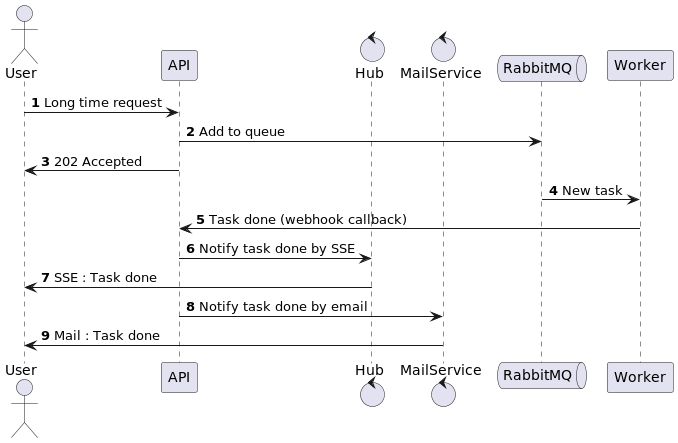

## Sequence Diagram



## Installation

Clone the project then in root directory run:

```bash
$ make build
```

## Run

Run with:

```bash
$ make up
```

Stop with:

```bash
$ make down
```

## Apps access

### RabbitMQ

Web access: http://127.0.0.1:15672/
Credentials: guest/guest

### The API

Web access: http://127.0.0.1:8080/api/doc

### The Hub

Web access: http://localhost:9999/.well-known/mercure/ui

### Frontend

Web access: http://127.0.0.1:8080/front/documents

### Mail Catcher Mailpit

Web access: http://127.0.0.1:8025/
